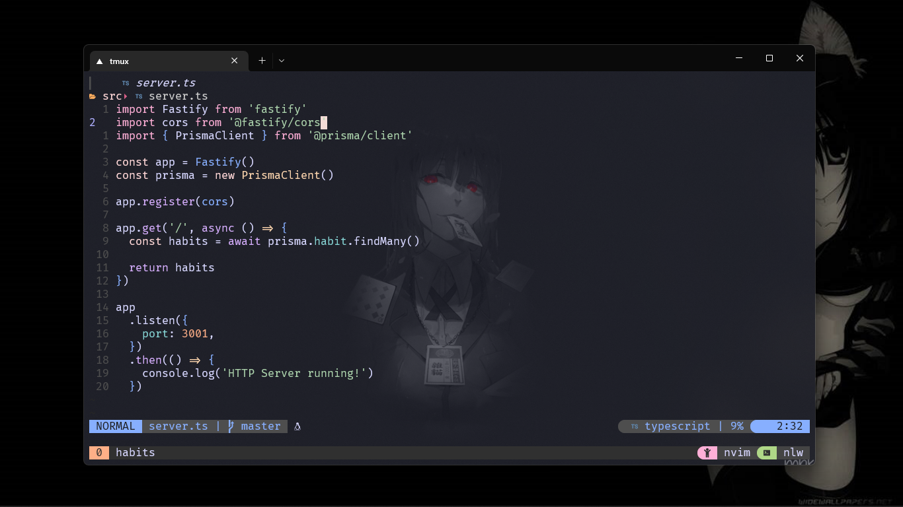

# Neovim 

🚀 Welcome to neovim config files 

> **Warning**
> Don’t copy/paste this setup at your local/virtual machine unless you have
> the minimum knowledge about neovim and its functionalities.

## Uses

* **Terminal:** Windows Subsystem for Linux (Ubuntu)
    * oh-my-zsh + tmux + neovim
* **Theme:** Catppuccin

## 🧩 Plugins

* packer.nvim

* catppuccin.nvim

* nvim-tree.lua

* nvim-web-devicons

* telescope.nvim

* telescope-file-browser.nvim

* lualine.nvim

* lspconfig

* lspsaga.nvim

* mason.nvim

* mason-lspconfig.nvim

* markdown-preview.nvim

* zen-mode.nvim
